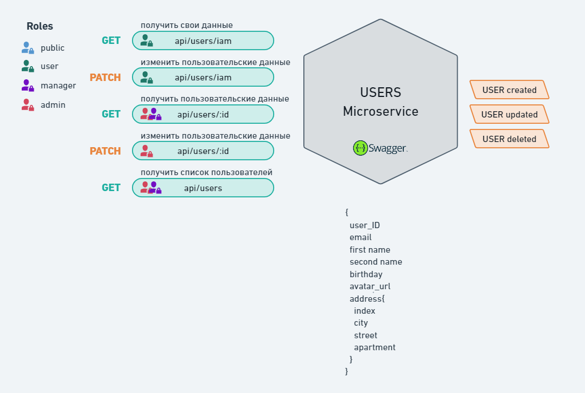

## Auth-microservice




##### add .env files
```
.env

# MONGO
MONGO_LOGIN=
MONGO_PASSWORD=
MONGO_HOST=
MONGO_PORT=
MONGO_PORT_TEST=
MONGO_AUTHDATABASE=

# RABBITMQ
RMQ_HOST=
RMQ_EXCHANGE_NAME=
RMQ_LOGIN=
RMQ_PASSWORD=

RMQ_QUEUE_NAME=
RMQ_SERVICE_NAME=
```
```
.env.test

# MONGO
MONGO_LOGIN=
MONGO_PASSWORD=
MONGO_HOST=
MONGO_PORT=
MONGO_AUTHDATABASE=

# TEST DATA
MONGO_PORT_TEST=

TEST_ADMIN_ID=
TEST_ADMIN_EMAIL=
TEST_ADMIN_ACCESS_TOKEN=

TEST_USER_ID=
TEST_USER_EMAIL=
TEST_USER_ACCESS_TOKEN=

# RABBITMQ
RMQ_HOST=
RMQ_EXCHANGE_NAME=
RMQ_LOGIN=
RMQ_PASSWORD=

RMQ_QUEUE_NAME=
RMQ_SERVICE_NAME=
```